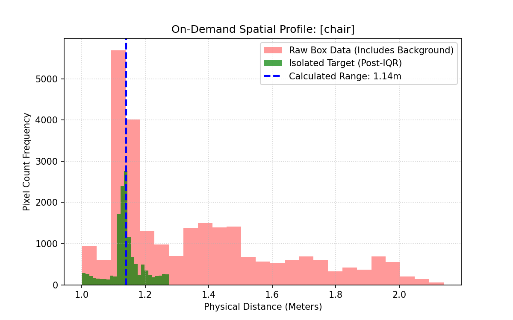

# Depth-Anything-V3 Server
The Purpose of this directory is to allow users to extract depth (in meters) from a depth map provided by [Depth-Anything-V3](https://depth-anything-3.github.io/). This repository contains local examples and provides the capability to turn any CUDA-enabled machine to turn into a server which handles only images in a LIFO (Last-In, First-Out) style stack. This is done to host a variety of ESP32s capable of communicating with the server.

## Requirements
This package assumes you've installed previous packages for the main rover code. You'll also need
- CUDA-capable machine with at least 8 GB VRAM

## Models
The following models provided by DA3 can actually produce a precise metric depth map
- [DA3METRIC-LARGE](https://huggingface.co/depth-anything/DA3METRIC-LARGE) : 0.35 Billion parameters
- [DA3NESTED-GIANT-LARGE](https://huggingface.co/depth-anything/DA3NESTED-GIANT-LARGE) : 1.40 Billion Parameters

## Architecture
You can view the implementation of the Server/Client Setup on the local network here:

Each of the **Rover Implementations** serve as a general box for any student looking to have and control a rover. That box can be copied with its inputs and outputs independtly of over devices. The impact of adding a new rover implementation is 3 more IPs on the local network and one more device capable of adding images to the server LIFO stack.

## Examples
This directory has multiple implementations of the Depth-Anything-V3 Metric Depth Map API including:
- [Local Camera](./examples/depth_map_local_camera.py) metric depth map visualization, side-by-side with the actual image. Connect a USB Webcam and go.
- [Simple Client & Server](./examples/simple_client_server_example.py) metric depth estimation of center pixel from network based camera.

### Rational
This part serves as thought process behind some of the implementations:

**YOLO + DA3 Server**
The rover recognizes the object that it wants to navigate to, which provides a bounding box (x,y pixels) and some confidence. If the confidence is high enough, the laptop sends an image to the server which sends a metric depth map back to the laptop. We can then take the bounding box coordinates from the image, and essentially create a histogram of the depth of each of the pixels within the depth map, throw out the outliers via some filter, then take the average and return that distance.

**Filtering the Images**
When we get a bounding box around a captured object we can easily encapsulate the depth map. The issue is that the depth map isn't subjective and silhoutte of the object is smaller than the outline of the bounding box. There are then scenarios where the background region between the silhoutte and the bounding box is full of depths that are larger/smaller than the desired object, thus they need to be filtered out. All we have to do is plot the various depths (x-axis) against the frequency they show up (y-axis) in the form of a histogram, this data should provide a visual for how often the distances of the actual object show up. We can then filter out the outlying buckets and expand out the "true" distances given some tolerance, then average out our new data.

## Results
This code has been tested on the following platforms:
- NVIDIA 5060 TI, Ubuntu 24.04, 8 GB VRAM
  - Local DA3METRIC-Large Results:
    - Local Camera : 10 ms feedforward loop rate
    - Server/Client Local Camera : 50 ms feedforward loop rate
    - Server/Client Rover Camera : 100-230 ms feedforward loop rate
    - Server/Client Rover Camera + YOLO + DA3 : 150-350 ms feedforward loop rate

  - Local DA3NESTED-Giant-Large:
    - Local Camera : GPU memory **error**

